# Biblioteca Digital

Aplicacion web para descubrir, leer y reseñar obras literarias.

  

---

## Descripción General

La biblioteca digital ofrece un espacio donde el usuario puede explorar un catálogo organizado por categorías, leer obras, descargar obras, publicar reseñas con calificación por estrellas y gestionar su cuenta personal.

El proyecto se desarrolló sin frameworks, tanto en el frontend como en el backend, lo que implicó implementar manualmente cada mecanismo de seguridad.

---

## Funcionalidades Principales

### Catálogo e Interfaz

* **Catálogo por categorías:** Carruseles de libros de Terror, Acción, Aventura y Ficción.
* **Modo claro y oscuro:** Respeta la preferencia del sistema y recuerda la elección del usuario.
* **Diseño adaptable:** Se ajusta a escritorio, tablet y móvil.

  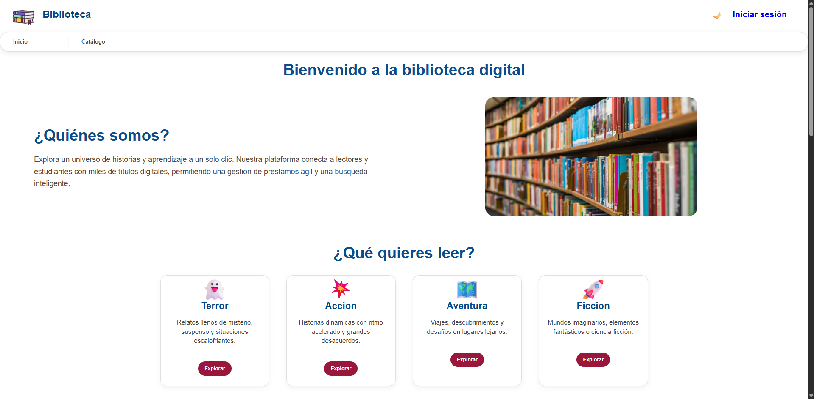
  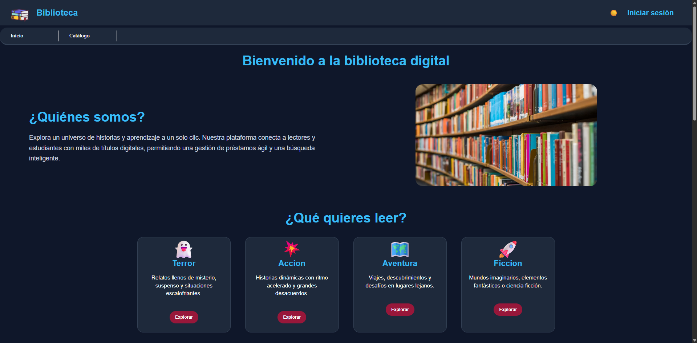

  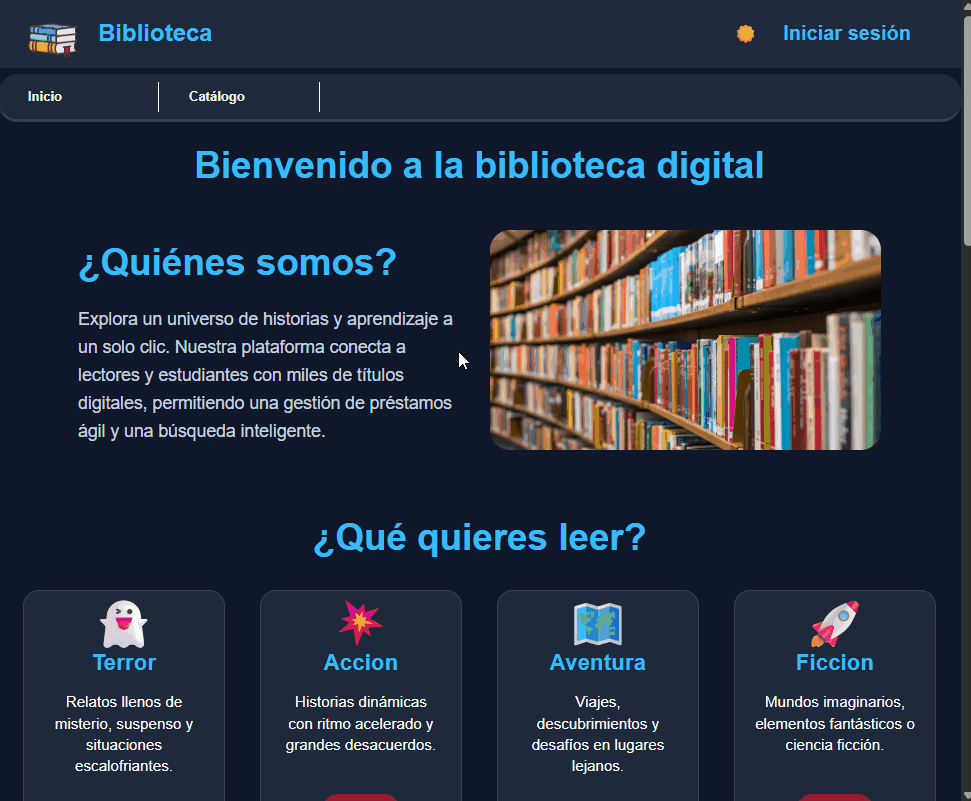

  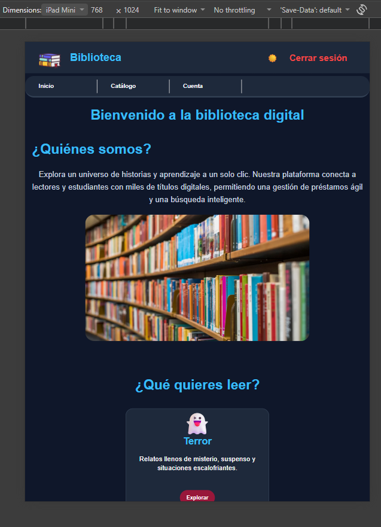

### Detalle de Libros y Lectura

* **Ficha de cada obra:** Portada, nombre de la obra, autor y sinopsis.
* **Lectura en línea:** El libro se abre directamente en el navegador.
* **Descargar el libro:** Si deseas conservar una copia local.
* **Acceso protegido:** Los libros solo están disponibles para usuarios autenticados.

  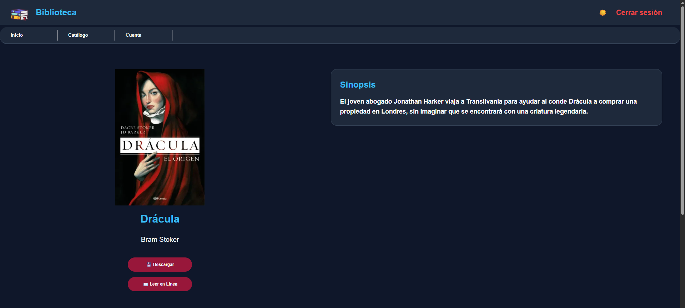

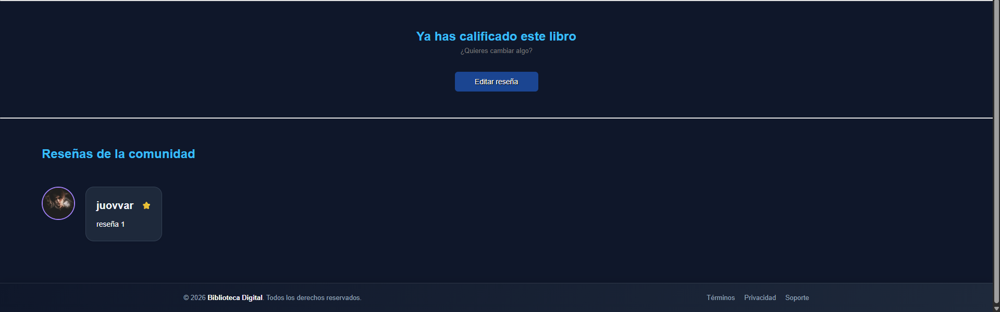

### Sistema de Reseñas

* **Calificación por estrellas** de 1 a 5.
* **Una reseña por usuario y libro**, que puede editarse o eliminarse en cualquier momento.
* **Reseñas de la comunidad** visibles en la ficha de cada obra.

  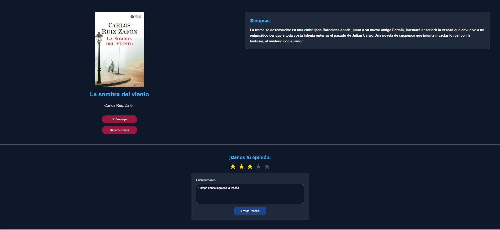

  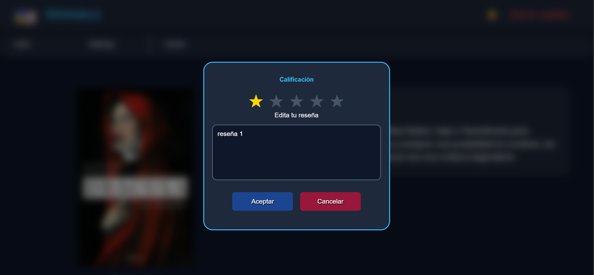

### Registro e Inicio de Sesión

* **Validación de contraseña en tiempo real:** longitud mínima, mayúsculas, minúsculas, números y caracteres especiales.
* **Mensajes claros** ante errores y tras un registro exitoso.

    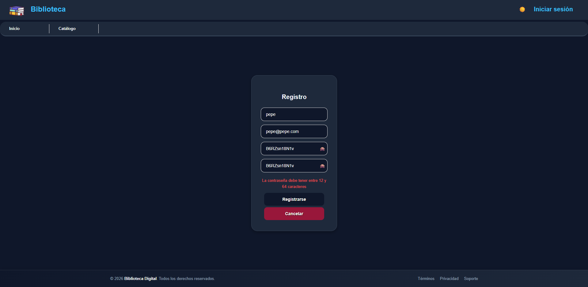  

    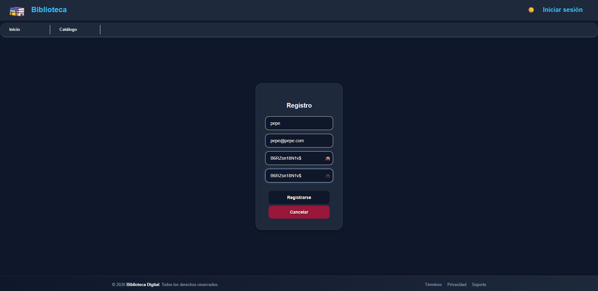

    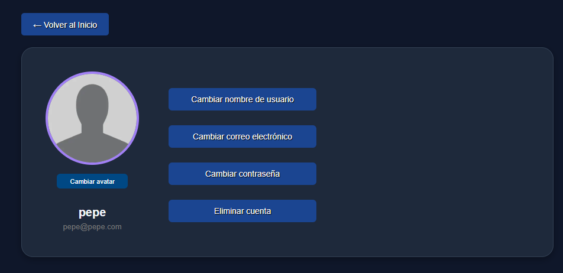

Si el usuario ya tiene una sesión iniciada, las páginas de acceso y registro le ofrecen cerrarla en lugar de mostrar el formulario:

  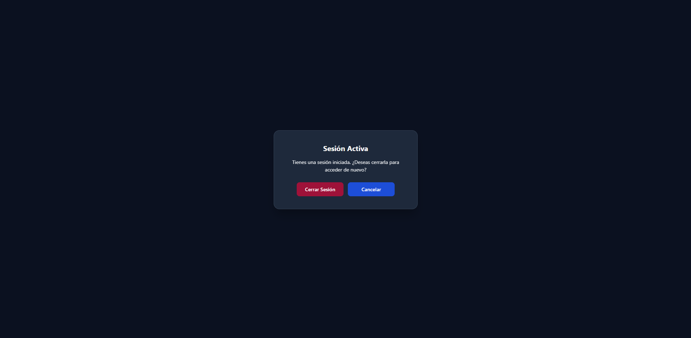

  

### Panel de Cuenta

* **Perfil personal:** avatar, nombre y correo.
* **Mis reseñas:** listado con opciones para editar y eliminar.
* **Ajustes:** cambio de nombre, correo y contraseña, y eliminación de la cuenta. Los cambios sensibles requieren confirmar la contraseña actual.

  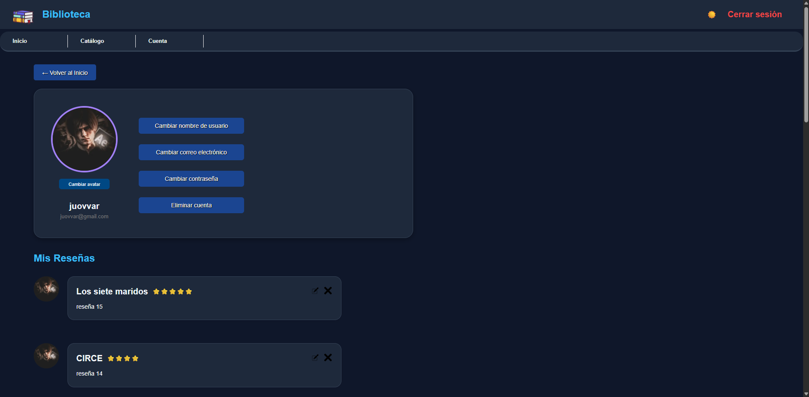

Ver ventanas de ajustes de la cuenta

  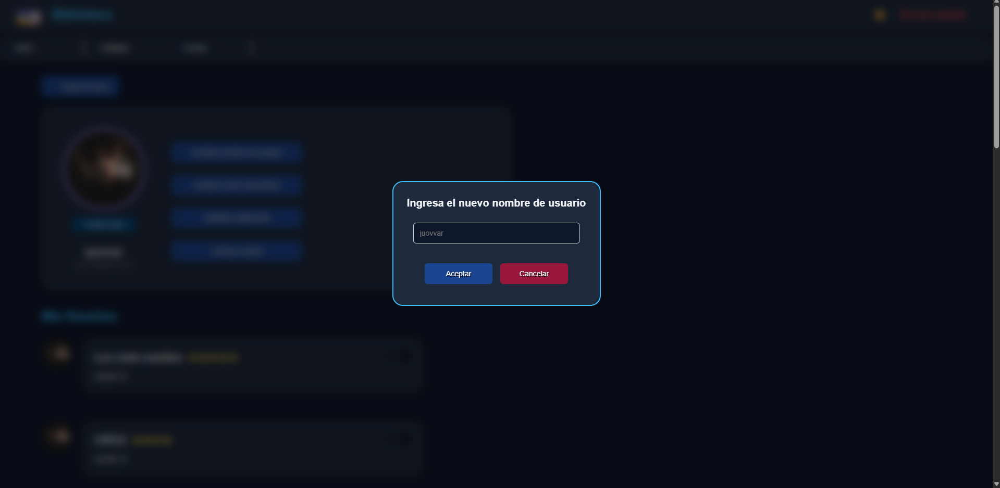
  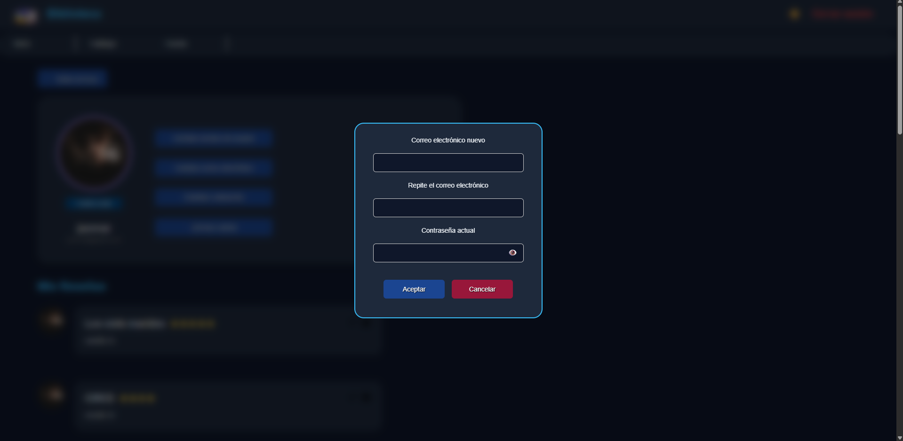

  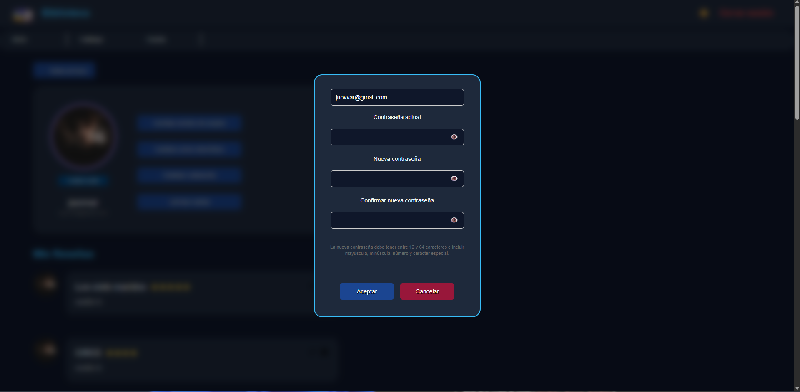
  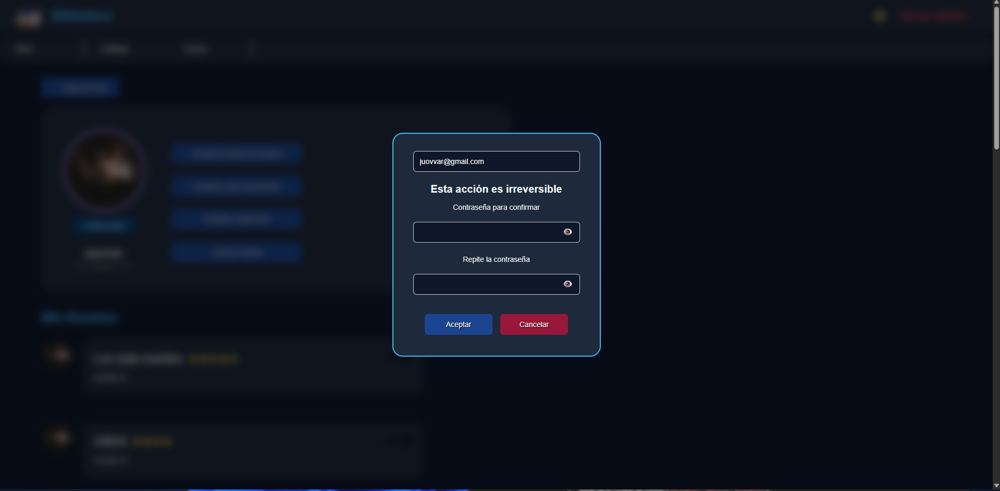

### Secciones Legales

* Términos, política de privacidad y soporte, organizados en pestañas.

---

## Seguridad

La seguridad fue el eje del desarrollo. El proyecto pasó por un ciclo completo de **auditoría, corrección y verificación**:

1. **Auditoría del código:** revisión de todo el proyecto para identificar vulnerabilidades y clasificarlas por severidad.
2. **Corrección:** refactorización del backend, el frontend, la configuración del servidor y la base de datos.
3. **Verificación:** pruebas manuales de manipulación de peticiones, revisión de cabeceras y cookies en producción, y escaneo con **OWASP ZAP**, incluido el análisis de falsos positivos.

### Controles implementados

* **Consultas preparadas** en todos los accesos a la base de datos, contra inyección SQL.
* **Escapado de toda la salida** contra Cross-Site Scripting (XSS).
* **Tokens anti-CSRF** en todos los formularios, incluido el cierre de sesión.
* **Sesiones seguras:** cookies `HttpOnly`, `Secure` y `SameSite`, regeneración del identificador al iniciar sesión, cierre por inactividad e invalidación de las sesiones abiertas al cambiar credenciales.
* **Protección contra fuerza bruta:** límite de intentos en el inicio de sesión, el registro y la reautenticación.
* **Mitigación de enumeración de usuarios:** mensajes genéricos y tiempos de respuesta uniformes.
* **Validación en el servidor** de todas las entradas, reforzada con restricciones en la base de datos.
* **Subida de imágenes segura:** validación de tipo y dimensiones, reescalado y recodificación de cada avatar.
* **Cabeceras de seguridad:** Content Security Policy estricta para scripts, HSTS, protección contra clickjacking y `nosniff`.
* **Control de acceso** a los documentos y a los directorios internos del proyecto.
* **Gestión de errores:** los fallos se registran internamente sin exponer detalles al usuario.

---

## Tecnologías Utilizadas

* **Frontend:** HTML5, CSS3 y JavaScript (Vanilla ES6), sin frameworks ni dependencias externas.
* **Backend:** PHP nativo.
* **Base de datos:** MariaDB (InnoDB, `utf8mb4`).
* **Servidor web:** Apache.
* **Despliegue:** InfinityFree con HTTPS.
* **Pruebas de seguridad:** OWASP ZAP y Chrome DevTools.

### Decisiones técnicas

* **Configuración por entorno:** el proyecto detecta si se ejecuta en local o en producción y ajusta la conexión, las URL y la seguridad de las cookies sin modificar archivos al desplegar.
* **Seguridad centralizada:** sesiones, tokens CSRF, validaciones y límites de intentos se gestionan desde un único módulo reutilizable.
* **Sin JavaScript en línea:** todos los eventos se gestionan mediante delegación, lo que permite una política CSP estricta.

---

## Trabajo Futuro

* Verificación del correo electrónico mediante un servicio SMTP.
* Recuperación de contraseña con enlaces de un solo uso.
* Eliminación de los estilos en línea para endurecer también la política de estilos.
* Panel de administración para gestionar el catálogo, aprovechando el sistema de roles existente.

---

## Nota

Proyecto desarrollado con fines educativos y de portafolio. El código fuente se mantiene en un repositorio privado.
